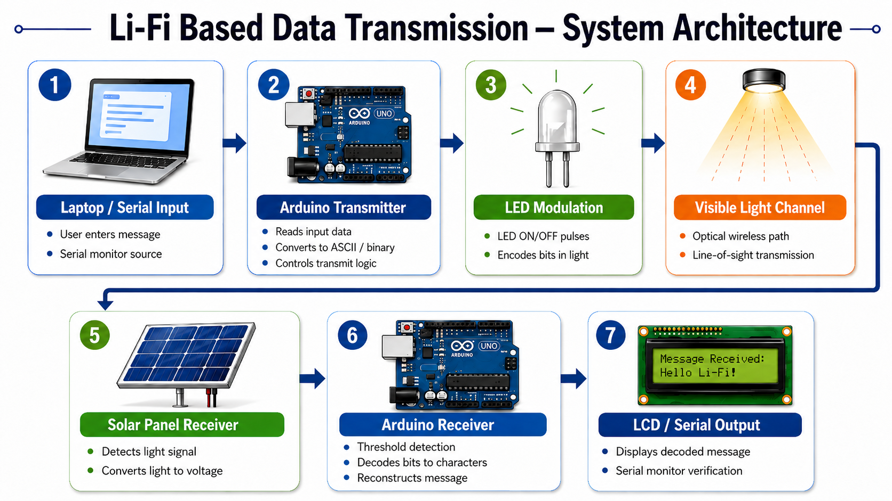
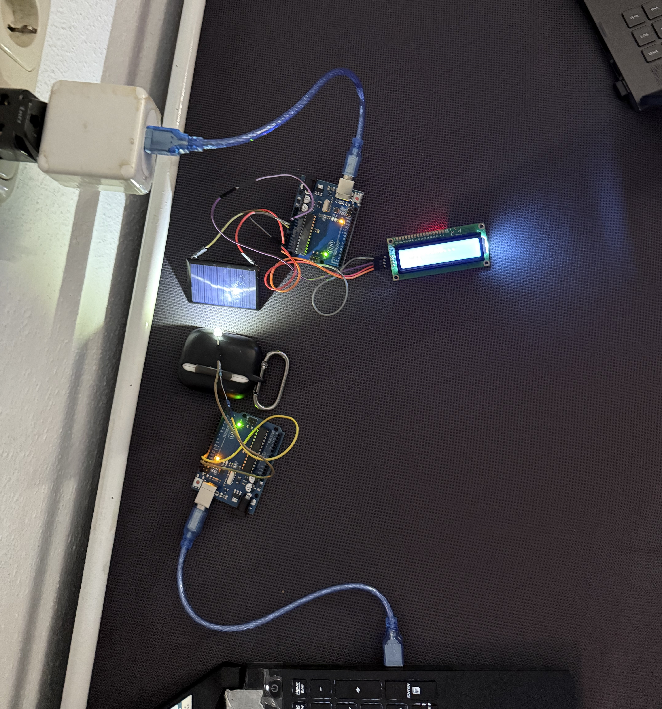
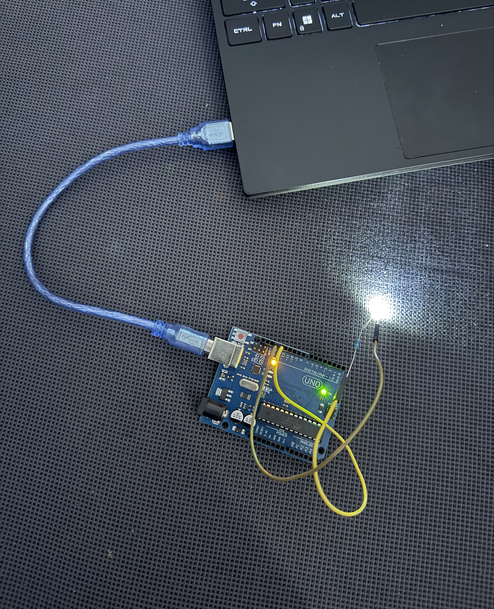
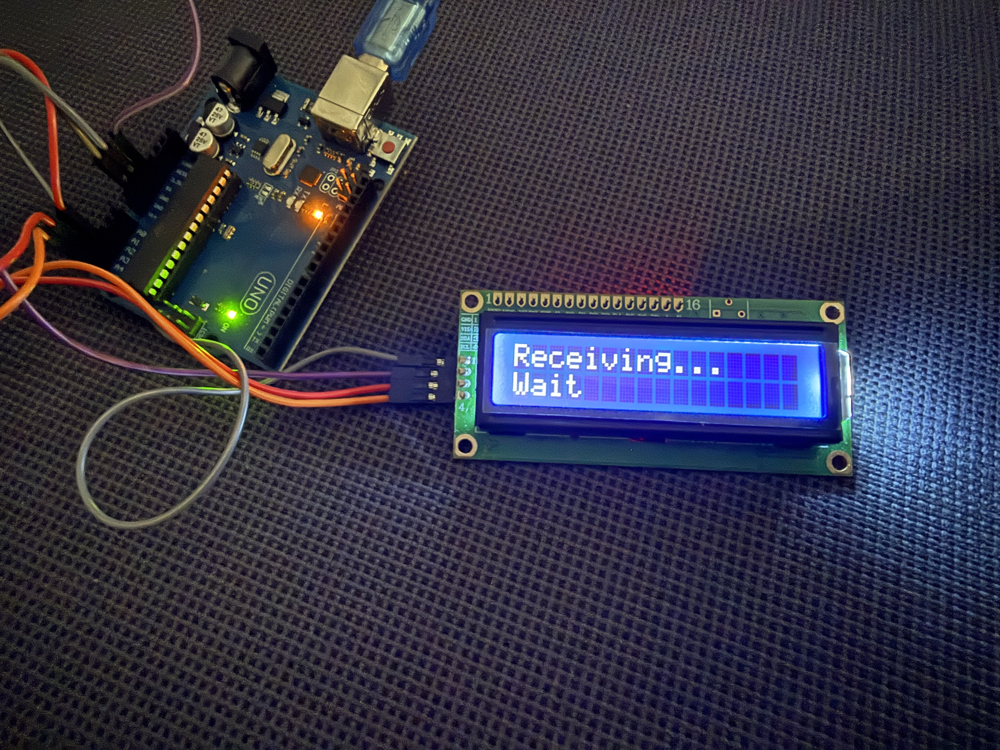
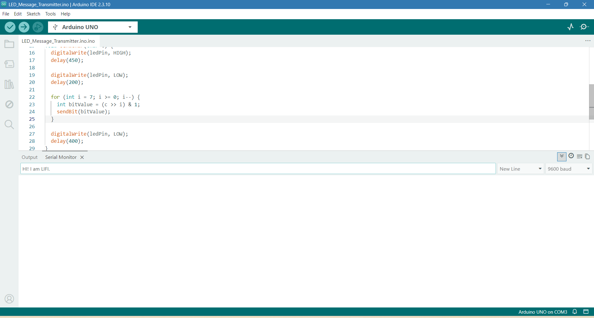

<div align="center">

# Li-Fi Based Data Transmission

### Wireless communication using visible light

[](#)
[](#)
[](#)
[](#)

**Team:** Jeel Sidpara · Aatman Sabhaya  
**Course:** FWPM - Internet of Things, TH Rosenheim, SoSe 2026

</div>

---

## Explore the Project

[Overview](#short-description) · [Architecture](#architecture) · [Setup](#how-to-setup) · [Results](tests/final_test_results.md) · [Presentation](#final-presentation) · [Poster](#project-poster)

### Project Highlights

- Transmits text wirelessly using visible light instead of radio waves
- Encodes characters as 8-bit ASCII and modulates them through an LED
- Reconstructs received data using a solar panel and Arduino Uno
- Displays decoded messages on a 16×2 I2C LCD
- Includes source code, wiring guidance, test results, presentations, and posters

---

## Short Description

This project demonstrates a working **Li-Fi (Light Fidelity)** prototype built with two Arduino Uno boards. The transmitter converts text entered in the Serial Monitor into 8-bit ASCII binary and drives an LED — ON for `1`, OFF for `0`. The receiver reads incoming light intensity through a solar panel, applies a calibrated threshold to classify each bit, reconstructs the ASCII character, and displays it on a 16×2 I2C LCD. The system successfully transmits short text messages such as `A`, `HI`, `HELLO`, and `IOT` under controlled indoor conditions at a range of 1–2 cm.

---

## Motivation

Traditional wireless technologies (Wi-Fi, Bluetooth, cellular) rely on RF signals. RF has well-known limitations in specific environments:

- **Spectrum congestion** — limited RF bandwidth in dense deployments
- **Security risk** — RF signals pass through walls and can be intercepted
- **RF-restricted zones** — hospitals, aircraft, and industrial facilities prohibit RF near sensitive equipment
- **Interference** — multiple devices on shared bands degrade performance

Li-Fi addresses these directly: the visible light spectrum is orders of magnitude wider than RF, signals are physically bounded by line-of-sight, and no spectrum licence is required. This project proves that Li-Fi data transmission is achievable with low-cost, commodity hardware.

Full motivation document: [docs/motivation_and_problem.md](docs/motivation_and_problem.md)

---

## MVP / Boundary Definition

### What this prototype CAN do

| Capability | Detail |
|---|---|
| Binary ON/OFF transmission | Reliably distinguishes LED-ON (`~600`) from LED-OFF (`~350`) using threshold `500` |
| ASCII text transmission | Sends and receives short messages: `A`, `HI`, `HELLO`, `IOT` |
| LCD display output | Shows decoded messages on a 16×2 I2C LCD (up to 32 characters) |
| Serial Monitor I/O | Transmitter reads input; receiver confirms output |

### What this prototype CANNOT do

| Limitation | Reason |
|---|---|
| Long range | Reliable operation only at 1–2 cm LED-to-sensor distance |
| High speed | Solar panel response limits bit rate to ~5 bits/second (200 ms/bit) |
| Through-wall communication | Requires direct line-of-sight |
| Error correction | No parity, checksum, or retransmit logic |
| Bidirectional communication | One-way only: transmitter → receiver |

Full document: [docs/mvp_and_scope.md](docs/mvp_and_scope.md)

---

## Architecture

### Logical Architecture — Data Flow

```text
User types message in Serial Monitor
             ↓
Transmitter: character → 8-bit ASCII binary
             ↓
LED modulation: ON = bit 1 / OFF = bit 0  (200 ms per bit)
             ↓
Visible light channel (line-of-sight, 1–2 cm)
             ↓
Solar panel: analog light reading (range 0–1023)
             ↓
Receiver: threshold comparison (500) → bit 0 or 1
             ↓
8 bits assembled → ASCII character
             ↓
LCD display + Serial Monitor output
```

### Technical Architecture — IoT Layers

| IoT Layer | Implementation |
|---|---|
| **Things** | 2× Arduino Uno, 1× LED, 1× solar panel, 1× 16×2 I2C LCD |
| **Connectivity** | Visible light channel — LED ON/OFF modulation |
| **Data** | ASCII characters → 8-bit binary streams |
| **Processing** | Threshold classification (threshold = 500), bit assembly, ASCII decode |
| **Output** | 16×2 LCD display and Serial Monitor |

### System Architecture Diagram



---

## Repository Structure

```text
LiFi-Based-Transmission/
├── src/          Arduino transmitter and receiver sketches
├── docs/         Architecture, hardware, testing, and presentations
├── tests/        Experiment procedures and final results
├── media/        Circuit photographs and project posters
└── README.md     Project overview and setup guide
```

---

## How to Setup

### Requirements

- Arduino IDE ([download](https://www.arduino.cc/en/software))
- Library: `LiquidCrystal I2C` by Frank de Brabander
  ```
  Arduino IDE → Tools → Manage Libraries → search "LiquidCrystal I2C" → Install
  ```

### Wiring

**Transmitter**

| LED | Arduino Uno |
|---|---|
| Anode (+) | Digital pin `13` |
| Cathode (−) | Resistor → `GND` |

**Receiver**

| Component | Arduino Uno |
|---|---|
| Solar panel (+) | Analog pin `A3` |
| Solar panel (−) | `GND` |
| LCD VCC | `5V` |
| LCD GND | `GND` |
| LCD SDA | `A4` |
| LCD SCL | `A5` |

### Upload and Run

1. Connect receiver Arduino → open [Final_Solar_LCD_Message_Receiver.ino](src/receiver/Final_Solar_LCD_Message_Receiver/Final_Solar_LCD_Message_Receiver.ino) → select board `Arduino Uno` + correct COM port → **Upload**
2. Connect transmitter Arduino → open [Final_Message_Transmitter.ino](src/transmitter/Final_Message_Transmitter/Final_Message_Transmitter.ino) → select board + COM port → **Upload**
3. Open Serial Monitor on transmitter at **9600 baud**, line ending: **Newline**
4. Place LED directly in front of solar panel at **1–2 cm**
5. Type a message (e.g. `HI`) in Serial Monitor → press Enter → observe LCD on receiver

### Circuit Photos

| Full Setup | Transmitter | Receiver | LCD Output |
|---|---|---|---|
|  |  |  |  |



---

## Costs / Business Model

> Multiple business models are possible. The following applies to the **healthcare domain** — the primary vertical where Li-Fi's RF-free nature has direct regulatory value.

| Dimension | Description |
|---|---|
| **Problem** | RF interference disrupts medical devices in ICU / MRI zones |
| **Solution** | Li-Fi: zero RF emission, room-contained, inherently private |
| **Revenue** | Hardware kit sale (one-time) + SaaS monitoring dashboard (recurring) |
| **Cost** | Hardware ~€30 prototype / ~€100 production unit |
| **Market** | 0.1% of hospital wireless market ≈ $10M+ |
| **Key advantage** | No spectrum licence, no RF, low power, low cost |

Full document: [docs/business_model.md](docs/business_model.md)

---


## Final Presentation

The final presentation (20 min + Q&A) is available here:

[docs/presentations/Final_presentation_IoT_group4_LiFi.pdf](docs/presentations/Final_presentation_IoT_group4_LiFi.pdf)

Earlier milestone presentations:

- [IoT_interim_presentation_1_group4_LiFi.pdf](docs/presentations/IoT_interim_presentation_1_group4_LiFi.pdf) — M1
- [IoT_interim_presentation_2_group4_LiFi.pdf](docs/presentations/IoT_interim_presentation_2_group4_LiFi.pdf) — M2

---

## Project Poster


Downloads: [A3 PDF](media/posters/LiFi_Poster_A3.pdf) · [A1 PDF](media/posters/LiFi_Poster_A1.pdf)

---

## Team

| Member | Contribution |
|---|---|
| [Jeel Sidpara](https://github.com/jeelsidpara2811) | Testing, hardware prototype, project documentation, and GitLab work items |
| [Aatman Sabhaya](https://github.com/Aatmanium) | Transmitter and receiver circuit assembly, testing support, and Arduino Uno environment setup |

*FWPM Internet of Things — TH Rosenheim, SoSe 2026*

---

<div align="center">

Designed, built, and documented by [Jeel Sidpara](https://github.com/jeelsidpara2811) and [Aatman Sabhaya](https://github.com/Aatmanium).

</div>
